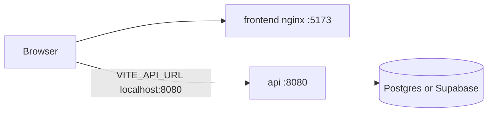

# Docker Compose + share on completed phases

## 1. Full-stack Compose (parent folder)

The API already has [beira-linha-play-backend/docker-compose.yml](C:/Users/davim/Projects/beira-linha-play/beira-linha-play-backend/docker-compose.yml) (API only) and [docker-compose-with-local-db.yml](C:/Users/davim/Projects/beira-linha-play/beira-linha-play-backend/docker-compose-with-local-db.yml) (API + Postgres). Those stay as they are.

New files live in `**C:\Users\davim\Projects\beira-linha-play**` (sibling of the two repos), as you chose.



**Frontend image** in [beira-linha-play-frontend/Dockerfile](C:/Users/davim/Projects/beira-linha-play/beira-linha-play-frontend/Dockerfile):

- Build stage: `npm ci` + `npm run build` with `ARG VITE_API_URL` (browser must see `http://localhost:8080`, not the Docker hostname `api`).
- Runtime: nginx serving `dist`, with SPA fallback (`try_files $uri /index.html`) so refresh on `/cursos/...` does not 404.
- Add `.dockerignore` (`node_modules`, `dist`, tests).

**Two compose files:**

- `docker-compose.yml` — **Supabase** (no Postgres service). Builds `api` from `./beira-linha-play-backend` and `frontend` from `./beira-linha-play-frontend`. API `env_file`: `./beira-linha-play-backend/.env`. Pass through `SPRING_DATASOURCE_`\*. CORS: `APP_ALLOWED_HOSTS=http://localhost:5173`.
- `docker-compose.local-db.yml` — same stack **plus** `postgres:16-alpine` (healthcheck + volume, same pattern as the backend compose). **Override** `SPRING_DATASOURCE_URL` to `jdbc:postgresql://postgres:5432/${POSTGRES_DB}` so a Supabase URL in `.env` cannot leak into this file. `api` waits on `postgres` healthy.

**Commands:**

```bash
# Supabase (credentials in beira-linha-play-backend/.env)
docker compose -f docker-compose.yml up --build

# Banco local
docker compose -f docker-compose.local-db.yml up --build
```

Front: `http://localhost:5173`. API: `http://localhost:8080`. Flyway already runs on API boot (`ddl-auto: validate`).

Parent `.env.example` only documents the two commands and points to `beira-linha-play-backend/.env.example` + `beira-linha-play-frontend/.env.example`. Cloudinary vars stay in the frontend `.env` if you later need them for medals; they are not required to boot Compose.

---

## 2. Share buttons on completed map phases

Show **only** when the student modal is **concluded** (`showProgress && progress === 100`) in [PhaseProgressModal.tsx](C:/Users/davim/Projects/beira-linha-play/beira-linha-play-frontend/src/pages/mapa/components/ProgressModal/PhaseProgressModal.tsx). Staff and in-progress phases stay as they are.

**Achievement card (what gets shared):** a dedicated visual in the completed modal (not a screenshot of the whole dialog): Beira Linha Play, **nome institucional** (`user.nome`, not `apelido`), “Concluí o nível X”, XP atual / XP da fase. Rendered as a 1080×1080 (Instagram-friendly) node, exported to PNG via `html-to-image` (or equivalent). Pass `nome` + `pontos` from `useAuthUser` through `PhaseNode` → modal.

**LinkedIn:** Instagram-style image attach is not available on LinkedIn’s web share. Use `https://www.linkedin.com/sharing/share-offsite/?url=...` plus a **copied caption** (`Gustavo Aguiar concluiu o nível 5 no Beira Linha Play com N XP.`). The URL is the public app origin (e.g. production, or `window.location.origin`). LinkedIn only previews Open Graph of that URL (generic site tags in [index.html](C:/Users/davim/Projects/beira-linha-play/beira-linha-play-frontend/index.html)); the “beautiful” piece is the card in our UI + the caption. Optionally also `navigator.clipboard.writeText` and a toast.

**Instagram:** there is **no** official web API to post to the feed. Plan:

- Prefer `navigator.share({ files: [png], text: caption })` (mobile share sheet often includes Instagram / Stories).
- Fallback: download the PNG + copy caption + open `https://www.instagram.com/` with a short toast explaining “cole a imagem e o texto no post”.

New pieces (map feature, not global):

- `pages/mapa/components/ProgressModal/AchievementCard.tsx` — dumb visual
- `pages/mapa/components/ProgressModal/ShareButtons.tsx` — LinkedIn + Instagram
- `pages/mapa/hooks/useShareAchievement.ts` — export PNG, share/copy/download
- Wire into the concluded branch of `PhaseProgressModal` / `ModalFooter`
- Tests in `PhaseProgressModal.spec.tsx` (buttons only when concluded; hidden for staff / in-progress)

No backend change required for this share slice.
