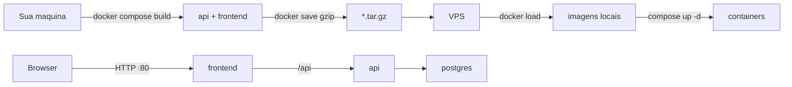

# Deploy em VPS: imagens Docker + docker load

**Fluxo principal (opção 2):** você constrói as imagens **na sua máquina** (onde está o código). Exporta `.tar.gz`. Quem sobe na VPS **não recebe fonte**: só Compose + imagens + `.env`.

**Ao executar este plano:** branch `prod` nos dois repositórios (`beira-linha-play-frontend` e `beira-linha-play-backend`). Não commitar na `main`/`dev`.



O Compose atual (`[docker-compose.yml](C:\Users\davim\Projects\beira-linha-play\docker-compose.yml)` e `[docker-compose.local-db.yml](C:\Users\davim\Projects\beira-linha-play\docker-compose.local-db.yml)`) continua para **dev** (5173/8080). Produção não publica 8080 nem 5432.

## O que você faz (sua máquina)

1. Build das imagens com nomes fixos, a partir do fonte:

- `beira-linha-play-api:latest` (Dockerfile atual do backend, Maven no build)
- `beira-linha-play-frontend:latest` (Dockerfile do frontend com `VITE_API_URL` vazio e Cloudinary nos ARGs)

2. Script `scripts/export-images.ps1`:

```
 docker save beira-linha-play-api:latest | gzip > beira-linha-play-api.tar.gz
 docker save beira-linha-play-frontend:latest | gzip > beira-linha-play-frontend.tar.gz
```

Postgres: se a VPS tiver internet, ela faz `pull` de `postgres:16-alpine`. O script pode exportar Postgres também se a VPS for offline. 3. Zip para a outra pessoa / para a Hostinger.

Arquivos do zip (sem `src/`):

- `docker-compose.prod.yml` — **só `image:`**, sem `build:` (na VPS não existe pasta de fonte)
- `.env.example`, `DEPLOY.md`
- `beira-linha-play-api.tar.gz`
- `beira-linha-play-frontend.tar.gz`
- opcional: `postgres-16-alpine.tar.gz`
- overlay HTTPS (`docker-compose.https.yml`) para usar depois

Na VPS:

```bash
gunzip -c beira-linha-play-api.tar.gz | docker load
gunzip -c beira-linha-play-frontend.tar.gz | docker load
# se levou postgres:
gunzip -c postgres-16-alpine.tar.gz | docker load

cp .env.example .env   # preencher IP, senhas, JWT, Gemini
docker compose -f docker-compose.prod.yml up -d
# sem --build
```

Tars são **grandes** (centenas de MB). RAM da VPS ~2 GB para rodar (não precisa RAM de Maven/npm).

Atualizar: você gera imagens de novo, manda tars novos, `docker load` + `compose up -d`.

## Dois Composes (mesmo nome de imagem)

**Na sua máquina (tem fonte)** — `[docker-compose.build.yml](C:\Users\davim\Projects\beira-linha-play\docker-compose.build.yml)` (ou o script chama `docker build -t ...`):

- `api`: `build: ./beira-linha-play-backend`, `image: beira-linha-play-api:latest`
- `frontend`: `build: ./beira-linha-play-frontend` + build-args Cloudinary / `VITE_API_URL=`, `image: beira-linha-play-frontend:latest`

**Na VPS (sem fonte)** — `[docker-compose.prod.yml](C:\Users\davim\Projects\beira-linha-play\docker-compose.prod.yml)`:

- `postgres`: `postgres:16-alpine`, volume `beira_linha_pgdata`, healthcheck, **sem** `ports`
- `api`: `image: beira-linha-play-api:latest`, `env_file`, `SPRING_DATASOURCE_URL=jdbc:postgresql://postgres:5432/...`, **sem** porta 8080, `depends_on` postgres healthy
- `frontend`: `image: beira-linha-play-frontend:latest`, `80:80`
- `restart: unless-stopped`

## Ajustes nos repositórios

**Frontend Dockerfile** — ARGs `VITE_CLOUDINARY_`_ e `VITE_API_URL=` antes do `npm run build` (hoje só tem API URL; sem isso o `dist` na imagem sai com Cloudinary fictício). `[nginx.conf](C:\Users\davim\Projects\beira-linha-play\beira-linha-play-frontend\nginx.conf)`: gzip, cache de estáticos, proxy `/api/` → `http://api:8080` com Cookie e `X-Forwarded-`_.

**Backend** — Dockerfile multi-stage atual serve para gerar a imagem. `[.env.example](C:\Users\davim\Projects\beira-linha-play\beira-linha-play-backend\.env.example)`: URL `jdbc:postgresql://postgres:5432/...` e cookies HTTP vs HTTPS. Flyway vai na imagem (JAR).

`**.env` na VPS\*\* (não no git / não dentro da imagem da API além do que o `env_file` injeta em runtime):

- `POSTGRES_DB`, usuário/senha iguais no Postgres e no Spring
- `JWT_SECRET` (Base64)
- `GEMINI_API_KEY`
- `APP_ALLOWED_HOSTS=http://IP_PUBLICO`
- `APP_COOKIE_SECURE=false`, `APP_COOKIE_SAME_SITE=Lax`
- Cloudinary **não** precisa no `.env` da VPS: já foi bakeado no build da imagem do frontend

**HTTPS depois** — overlay Caddy `80`/`443`; frontend deixa de publicar 80 no host; `.env`: `APP_COOKIE_SECURE=true`, `APP_ALLOWED_HOSTS=https://dominio`.

**DEPLOY.md** — gerar tars; zip; instalar Docker na Hostinger; porta 80 no painel/`ufw`; `load` + `up -d`; backup `pg_dump`; HTTPS; nota curta de que JAR+dist (opção 1) existe se no futuro não quiser tars pesados.

## Cookies e CORS

Same-origin: `VITE_API_URL` vazio na imagem do frontend. Cookies HttpOnly, `SameSite=Lax`. HTTP: `Secure=false`. `APP_ALLOWED_HOSTS` = `http://IP`.
