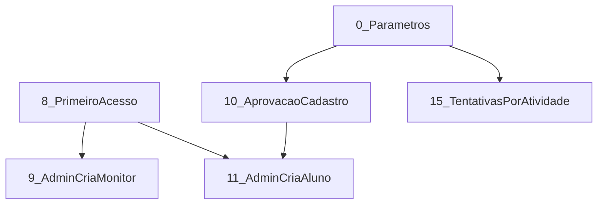

# Features incrementais (pedir uma ou várias por vez)

Quando for implementar, escreva **quais fatias** (ex.: “implemente 1 e 2” ou “só a 7”). Não precisa pedir o plano de novo.

Ordem sugerida se for em sequência: **0 → 1 → 2**, depois o restante em qualquer ordem, **exceto** 9–12 (dependem da 8) e a **15** (depende da 0).



---

## 0 — Parâmetros do admin (base)

Tela só **admin** (em `/cursos` ou `/configuracoes`) persistida no backend (tabela `configuracao_app`, uma linha).

Campos iniciais:

- `validarCadastroAluno` (default false)
- `validarCadastroMonitor` (default false)
- `monitorPodeDefinirTentativas` (default false)

GET/PUT `/api/configuracao` (admin). Front lê no cadastro/login e nas telas de atividade.

Sem esta fatia, as flags das fatias 10 e 15 não têm onde viver.

---

## 1 — Compartilhar: Web Share ou download

Em [useShareAchievement.ts](src/pages/mapa/hooks/useShareAchievement.ts): se `navigator.share` + arquivo PNG funcionar, usa; senão **só download** do PNG (sem clipboard / Instagram / toast de “cole no app”). Vale para o mapa e para as fatias 2.

---

## 2 — Modal de fase ao ganhar XP + “fim de jogo”

Depois de `persistAttempt` em [useQuizPlay.ts](src/pages/atividade/features/QuizPlay/hooks/useQuizPlay.ts): comparar `pontos` antes vs `pontosTotais`. Se cruzou o `minPoints` de uma fase, abrir modal com o card já usado no mapa ([AchievementCard.tsx](src/pages/mapa/components/ProgressModal/AchievementCard.tsx)).

- Incluir a medalha equipada (`user.imagemPerfil`) no card.
- Se cruzou a **última** fase: card “Você concluiu o Beira Linha Play” + grade das medalhas com `aluno.pontos >= medalha.pontosMin`.
- Botão Compartilhar = fatia 1.

Fases continuam as constantes até a fatia 14.

---

## 3 — E-mail PUC no auto-cadastro do monitor

Zod + backend: monitor só com `@pucminas.edu.br` (case-insensitive) em [auth.ts](src/data/schemas/auth.ts) e `AutenticacaoService` cadastro. Login/edição do mesmo e-mail.

---

## 4 — Sugestão de apelido a partir do nome

No [register.tsx](src/pages/auth/register.tsx) (aluno): 3–5 sugestões a partir do nome (primeiro+último, sem acento, número se colidir). Clique preenche o campo. Checagem de apelido ocupado se já existir endpoint; senão só no submit.

---

## 5 — QR e link do código do curso

No header do curso ([curso/index.tsx](src/pages/curso/index.tsx)), só monitor/admin: QR + copiar `https://…/entrar/{codigoAcesso}` (ou query em `/cursos`). Rota que, logado como aluno, chama o enroll atual. Biblioteca QR no front (`qrcode.react` ou equivalente).

---

## 6 — Ano, semestre e modalidade no curso

Backend + [CursoType](src/data/types/api.ts) + [NewCourseDialog.tsx](src/pages/cursos/components/NewCourseDialog.tsx):

- `ano` (number)
- `semestre` (`1` | `2`)
- `modalidade` (`PRESENCIAL` | `ONLINE`)

Mostrar no card da lista. Cursos antigos: migration com default (ex. ano atual / semestre 2 / PRESENCIAL) ou campos opcionais até o admin editar.

---

## 7 — Copiar módulos e atividades entre cursos

`POST /api/cursos/{destinoId}/modulos/copiar` com `moduloOrigemId` (e opcionalmente `atividadeIds`). Deep copy com novos UUIDs (módulo → atividades → questões → alternativas). UI no detalhe do módulo/curso: escolher curso destino. Monitor só se ministra os dois; admin todos.

---

## 8 — Primeiro acesso (senha) — infra compartilhada

Usuários criados por admin/planilha nascem com `senhaHash` nulo e token de primeiro acesso.

- Link `/primeiro-acesso?token=…` → definir senha (≥6).
- Login normal recusa conta sem senha e aponta para o link (admin copia o link na lista).

Fatias 9 e 11 dependem disto.

---

## 9 — Admin cadastra monitores

Lista/CRUD de monitores (hoje só `GET /monitores`). Criar: nome + e-mail `@pucminas.edu.br`, **sem senha**. Expira em 6 meses (`acessoExpiraEm`). Auto-cadastro atual permanece (fatia 10 controla aprovação). Login bloqueia se expirado.

---

## 10 — Aprovação parametrizada do auto-cadastro

Se o parâmetro (fatia 0) estiver ligado: cadastro aluno/monitor fica `PENDENTE` e não loga até um admin aprovar (fila na área admin). Se desligado: igual hoje. Monitor pendente ainda precisa do e-mail PUC (fatia 3, se já existir).

---

## 11 — Admin cadastra alunos (+ planilha) e 6 meses

- Cadastro unitário: nome + apelido (único).
- Planilha CSV/xlsx: colunas `nome`, `apelido` (header na primeira linha). Já existe → não duplica; só garante convite de senha se ainda não definiu. Novo → 6 meses de acesso.
- Auto-cadastro continua; se fatia 10 estiver on, também entra na fila. `acessoExpiraEm` = cadastro + 6 meses (auto e admin). Login bloqueia expirado.

---

## 12 — Admins: expiração e revogação

Estender [NewAdminDialog.tsx](src/pages/cursos/components/NewAdminDialog.tsx) para **lista** de admins: criar (senha imediata **ou** primeiro acesso — preferir senha na criação como hoje), `acessoExpiraEm` default **agora + 6 meses**, editar data / revogar (`acessoExpiraEm = agora`). **Não** editar o próprio registro. Login admin também respeita expiração.

---

## 13 — Importar nomes de curso do Sympla

Token da API pública no `.env` do backend (`SYMPLA_TOKEN`), não no browser.

IDs dos eventos (configuráveis na tela de parâmetros, default `3548502` online e `3548498` presencial): `GET /public/v3/events/{id}/participants` paginado, `ticket_name` únicos → criar curso **só com `nome`** se ainda não existir. Não importa alunos. Admin confirma um preview “N nomes novos” antes de gravar.

Documentação: [API Sympla](https://developers.sympla.com.br/api-doc/index.html).

---

## 14 — Admin parametriza fases do mapa

Tabela `fase_mapa` (`ordem`, `pontosMin`). Admin: quantidade de fases + XP mínimo de cada uma. Front deixa de usar a fórmula fixa de [nodesPhases.ts](src/pages/mapa/constants/nodesPhases.ts); layout: reutilizar as posições das 16 fases atuais e, se N > 16, empilhar no eixo Y. Modal “fim de jogo” (fatia 2) usa a última fase dessa lista.

---

## 15 — Tentativas por atividade (default 2)

Coluna `max_tentativas` na atividade (default 2). Substituir `MAX_TENTATIVAS` global em domínio (`DomainRules`) e front ([constants.ts](src/data/constants.ts), quiz, cards). No formulário da atividade, o campo só aparece se `monitorPodeDefinirTentativas` (fatia 0). Senão, sempre 2.

---

## 16 — Aluno some do ranking dos outros

`apareceNoRanking` (default true) em [editAccount.tsx](src/pages/auth/editAccount.tsx). `GET /api/rankings`: lista sem quem optou por sair; o aluno logado **ainda vê a própria linha** com a posição real (calculada entre todos). Os outros não veem essa pessoa.

---

## 17 — Bug: monitoramento pela melhor tentativa

Hoje o monitor vê a **última** tentativa. Em [TentativaService.monitorar](C:/Users/davim/Projects/beira-linha-play/beira-linha-play-backend/src/main/java/br/icei/beiralinhaplay/aplicacao/tentativa/TentativaService.java) o agrupamento usa `max(dataEnvio)`:

```
.map(lista -> lista.stream().max(Comparator.comparing(Tentativa::dataEnvio)).orElseThrow())
```

Deve ser a de **maior `pontuacaoObtida`** (empate: a mais recente). A lista passa para [MonitoramentoReport.calcular](C:/Users/davim/Projects/beira-linha-play/beira-linha-play-backend/src/main/java/br/icei/beiralinhaplay/aplicacao/tentativa/MonitoramentoReport.java) (linha do aluno, média de XP, % de acerto e votos por alternativa) — tudo deve usar essa melhor, não a última.

Front: [toMonitoring](src/pages/monitoramento/utils/index.ts) só reflete a API. Se [latestAttemptByStudent](src/data/tentativas.ts) existir e for usado nesse fluxo, alinhar; senão o conserto é só no backend.

Teste: aluno com tentativa 8 pts depois 3 pts → monitoramento mostra 8 e as respostas da de 8. Não depende de outras fatias.

---

## Como pedir a implementação

Exemplos:

- `Implemente a fatia 1`
- `Implemente 0, 15 e 16`
- `Implemente a 2 (o modal de fase)`

Cada fatia deve incluir migration/API/UI/testes daquele recorte, sem puxar as outras.
